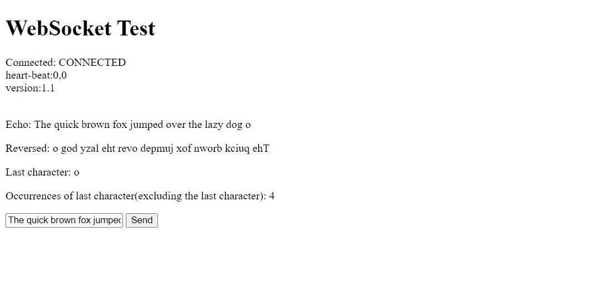
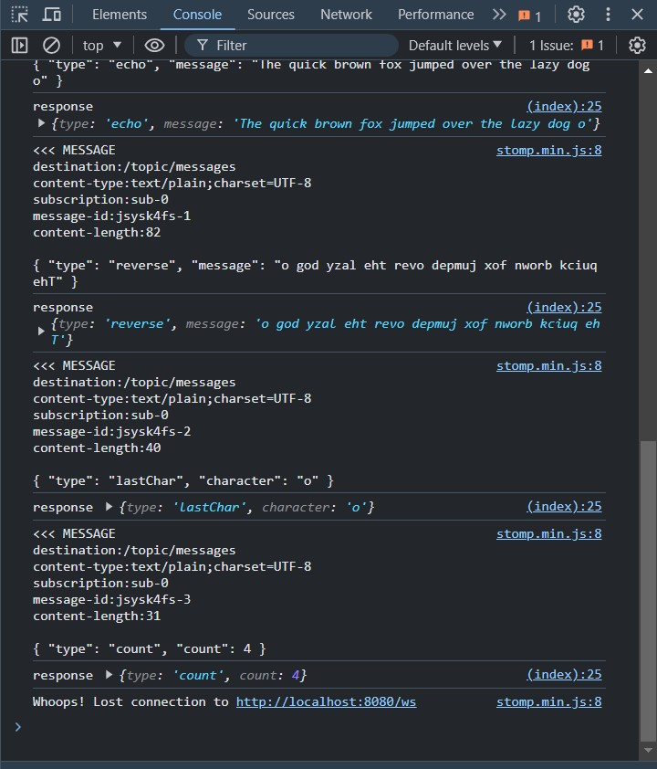

# Overview 

This documentation provides details on how to connect to the WebSocket server, the available actions, and the expected request and response formats in JSON. The WebSocket backend performs the following actions:

1. Echoes the message sent in a streaming format with a 0.1-second delay.
2. Echoes the message in reverse in a streaming format with a 0.1-second delay (after the 1st response).
3. Counts the number of times the last character is repeated in the message (excluding the last character) and returns this count.

# Connecting to the WebSocket Server
### WebSocket URL
The WebSocket server is hosted at the following URL:
```
http://localhost:8080/
```

# Available Actions
### Echo Message

1. **Description:** Echoes the sent message back to the client.
2. **Request:** Send a text message.
3. **Response:** The server will echo the message back to the client in a streaming format with a 0.1-second delay.

### Echo Reversed Message

1. **Description:** Echoes the sent message in reverse back to the client.
2. **Request:** Send a text message.
3. **Response:** The server will echo the reversed message back to the client in a streaming format with a 0.1-second delay(after the 1st response).

### Last Character

1. **Description:** Returns the last character of the message.
2. **Request:** Send a text message.
3. **Response:** The server will send back the last character in the message in a streaming format with a 0.1-second delay after the preceeding response.

### Count Last Character Occurrences

1. **Description:** Counts the number of times the last character is repeated in the message (excluding the last character) and returns this count.
2. **Request:** Send a text message.
3. **Response:** The server will send back the count of occurrences of the last character in the message (excluding the last character)in a streaming format with a 0.1-second delay after the preceeding response.

# Request and Response Formats

## Request Format

The client sends a **plain text message**. 

Example:
``
The quick brown fox jumped over the lazy dog o
``

## Response Format

The server responds with the following messages:

**1. Echo Message:**

Description: The server echoes the original message.

Example:
``
{
    "type": "echo",
    "message": "The quick brown fox jumped over the lazy dog o"
}
``


**2. Echo Reversed Message:**

Description: The server echoes the reversed message.

Example:
``
{
    "type": "reversed",
    "message": "o god yzal eht revo depmuj xof nworb kciuq ehT"
}
``


**3. Last Character:**

Description: The server returns the last character of the message.

Example:
``
{
    "type": "lastChar",
    "character": "o",
}
``


**4. Count Last Character Occurrences:**

Description: The server sends the count of occurrences of the last character in the message (excluding the last character).

Example:
``
{
    "type": "count",
    "count": 4
}
``


### **Combined Example**

**Given the input message** "The quick brown fox jumped over the lazy dog o", the combined response from the server would be:

Echo message:

``
{
    "type": "echo",
    "message": "The quick brown fox jumped over the lazy dog o"
}
``

Reversed message:

``
{
    "type": "reversed",
    "message": "o god yzal eht revo depmuj xof nworb kciuq ehT"
}
``

Last Character

``
{
    "type": "lastChar",
    "character": "o",
}
``

Count occurrences:

``
{
    "type": "count",
    "character": "o",
    "count": 4
}
``

## Output Images

**Front-end Output**


**Console**



**Disclaimer**:Since the task has not been hosted, it can only be run locally (I couldn't find any free hosting services for springboot application :( :pensive: )
